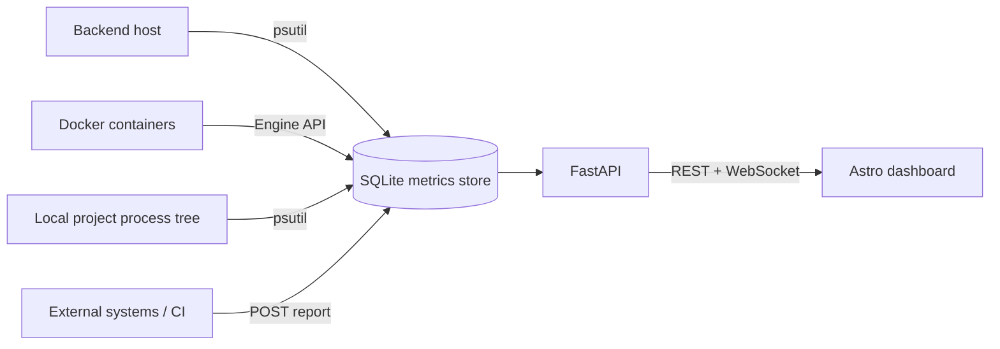

# CommitPulse

CommitPulse is a live performance dashboard that ties system and process metrics
to the Git commit they were produced on. Instead of just showing "CPU is at
40%", it records **who/what** was running (repository, branch, commit SHA and
message) alongside CPU, memory, disk and network usage, then lets you compare
how performance changed **from one commit to the next**.

It watches four kinds of things out of the box:

- **The backend host itself** – sampled locally with `psutil`.
- **External systems** – CI agents, servers or scripts that POST their own
  reports.
- **Docker containers** – every running container on a reachable daemon.
- **Local project process trees** – a repository you run on your machine, with
  tracking isolated to just that project's processes.

Every new sample is streamed to the browser over a WebSocket, so the dashboard
updates in real time.

---

## Features

- 📈 **Commit-aware metrics** – each sample carries repository, branch, commit
  SHA and message, and the dashboard rolls samples up per commit.
- 🔀 **Commit comparison** – see the current commit's CPU/memory/disk against
  the previous commit and per-commit averages.
- 🖥️ **Multi-source monitoring** – local host, reported systems, Docker
  containers and local project process trees, all in one system picker.
- 🐳 **Docker support** – zero-dependency polling of the Docker Engine API over
  its unix socket, with commit identity read from OCI image labels.
- 🎯 **Isolated project tracking** – point CommitPulse at a local repo and it
  aggregates only that project's process tree (launched or auto-discovered).
- ⚡ **Live updates** – new samples are pushed to all connected dashboards via
  `/api/live` (WebSocket) with automatic reconnect.
- 💾 **Durable history** – everything is stored in a local SQLite database and
  queryable through the HTTP API.

## Architecture



The FastAPI backend runs three background monitors (local, Docker, project) that
write into a single SQLite store, plus HTTP endpoints for ingesting external
reports and for the frontend to read from. New samples from any source are
broadcast to the Astro dashboard over a WebSocket.

## Tech stack

| Layer    | Technology                                             |
| -------- | ------------------------------------------------------ |
| Frontend | Astro, Tailwind CSS v4, Chart.js, anime.js, TypeScript |
| Backend  | FastAPI, Uvicorn, Pydantic, psutil, httpx              |
| Storage  | SQLite (WAL mode)                                      |

## Project structure

```text
CommitPulse/
├── backend/
│   ├── main.py                 # FastAPI app: routes, lifespan, monitor wiring
│   ├── metrics_store.py        # SQLite storage + the report schema
│   ├── performance_monitor.py  # local host sampling (psutil)
│   ├── docker_monitor.py       # Docker container sampling (Engine API)
│   ├── project_monitor.py      # local project process-tree tracking
│   ├── projects_api.py         # /api/projects REST router
│   ├── live_updates.py         # WebSocket broadcast hub
│   └── requirements.txt
├── src/
│   ├── components/             # dashboard UI (cards, chart, project manager…)
│   ├── layouts/Layout.astro
│   ├── pages/index.astro       # the dashboard page
│   ├── scripts/metrics-chart.ts
│   └── styles/global.css
├── public/
├── astro.config.mjs
├── package.json
├── tsconfig.json
└── README.md
```

---

## Prerequisites

- **Node.js** 22+ and npm
- **Python** 3.10+
- Optionally, a running **Docker** daemon if you want container monitoring

## Quick start

### 1. Install and start the backend

```bash
cd backend
python -m venv .venv

# macOS/Linux
source .venv/bin/activate
# Windows PowerShell
# .\.venv\Scripts\Activate.ps1

pip install -r requirements.txt
uvicorn main:app --host 0.0.0.0 --port 8000 --reload
```

The API is now available at `http://localhost:8000` (interactive docs at
`http://localhost:8000/docs`).

### 2. Start the frontend

In a second terminal, from the project root:

```bash
npm install
npm run dev
```

Open **http://localhost:4321**. Out of the box the dashboard will show the
`backend-local` system as the backend samples its own host.

---

## Metric sources

Every sample is stored with a `source` label. The dashboard's system picker
lists each `system_id · source` combination.

| Source     | What it measures                             | Default system id |
| ---------- | -------------------------------------------- | ----------------- |
| `local`    | The backend host, sampled with `psutil`      | `backend-local`   |
| `reported` | External systems that POST their own reports | caller-defined    |
| `docker`   | Each running Docker container                | container name    |
| `project`  | A local repository's isolated process tree   | project slug      |

### Local host (`local`)

Enabled by default. The backend samples its own CPU, memory, disk and network
every `METRICS_INTERVAL_SECONDS` (default 5s) and tags each sample with the
CommitPulse repository's current Git commit. Override the identity with
`METRICS_REPOSITORY_NAME`, `METRICS_COMMIT_SHA`, `METRICS_COMMIT_MESSAGE` and
`METRICS_BRANCH`, or disable it with `METRICS_POLLING_ENABLED=false`.

### External reports (`reported`)

Any system can push a report. This is ideal for CI runners or remote servers.

```bash
curl -X POST http://localhost:8000/api/webhooks/metrics/build-agent-01 \
  -H 'Content-Type: application/json' \
  -d '{
    "repository_name": "my-service",
    "commit_sha": "'"$(git rev-parse HEAD)"'",
    "commit_message": "'"$(git log -1 --format=%s)"'",
    "branch": "'"$(git branch --show-current)"'",
    "cpu_percent": 32.5,
    "memory_percent": 64.2,
    "memory_used_bytes": 6871947673,
    "memory_total_bytes": 10737418240,
    "disk_percent": 41.0,
    "disk_used_bytes": 4398046511,
    "disk_total_bytes": 10737418240,
    "network_sent_bytes": 429496729,
    "network_received_bytes": 858993459,
    "uptime_seconds": 86400
  }'
```

`POST /api/systems/{system_id}/metrics` behaves identically. `timestamp` is
optional (defaults to the server's UTC receive time). Set
`METRICS_WEBHOOK_SECRET` to require an `X-Webhook-Token` header on ingestion.
Each `system_id` may contain up to 128 letters, numbers, dots, underscores or
hyphens.

### Docker containers (`docker`)

When a Docker daemon is reachable, the backend polls every running container and
records it as its own system. It talks to the Docker Engine API over its unix
socket (`/var/run/docker.sock`) or a `tcp://` `DOCKER_HOST` — no extra
dependency required. If the daemon can't be reached, the monitor disables itself
gracefully.

Container stats map onto the shared metric schema as:

- **CPU** – fraction of total host CPU capacity used by the container (0–100).
- **Memory** – working-set usage vs. the container's memory limit.
- **Network** – cumulative bytes sent/received across all container interfaces.
- **Disk** – writable-layer size vs. total on-disk size (only when
  `DOCKER_COLLECT_DISK_USAGE=true`, since it makes the daemon walk the
  filesystem every poll).
- **Uptime** – seconds since the container started.

Commit identity is read from standard OCI image labels
(`org.opencontainers.image.revision` / `.source` / `.version` / `.title`), so
containers built by CI slot straight into commit comparisons. The monitor does
not inspect the container filesystem or run Git inside it, so including a Git
repository in the image or mounting one into the container is not enough by
itself. Without a revision label, the reported commit SHA is `unknown` and the
message defaults to `Docker container <name>`.

Set labels when building or starting the container to report its commit
metadata. For example, Docker Compose supports:

```yaml
services:
    app:
        image: my-app
        labels:
            org.opencontainers.image.revision: "${GIT_SHA}"
            org.opencontainers.image.source: "${GIT_URL}"
            org.opencontainers.image.version: "${GIT_BRANCH}"
            commit_message: "${GIT_MESSAGE}"
```

The revision supplies the commit SHA; source identifies the repository, version
supplies the branch, and `commit_message` supplies the commit message.

### Local project process trees (`project`)

Point CommitPulse at a local repository and it isolates and aggregates the CPU,
memory, disk I/O and uptime of **only that project's process tree**, recording
it as a `project` system with the repository's Git `HEAD` as commit identity.

Processes are attributed to a project in two complementary ways:

- **Launched** – if the project defines a `command`, the backend can spawn it in
  its own process group rooted at the repo and track it plus every descendant it
  forks (requires `PROJECTS_ALLOW_LAUNCH=true`).
- **Discovered** – any process whose working directory is inside the repository
  (optionally also matched by command line), plus its descendants. The backend's
  own process tree is always excluded so it never measures itself.

Manage projects from the dashboard's **Local projects** panel, or via the REST
API (see below). Tracked projects are persisted to
`backend/tracked_projects.json` and reloaded on startup.

---

## API reference

Base URL: `http://localhost:8000`

### Metrics

| Method | Path                                 | Description                                       |
| ------ | ------------------------------------ | ------------------------------------------------- |
| GET    | `/api/health`                        | Service health check.                             |
| GET    | `/api/systems`                       | List every `system_id` + `source` with last-seen. |
| POST   | `/api/systems/{system_id}/metrics`   | Ingest a report for a system (source `reported`). |
| POST   | `/api/webhooks/metrics/{system_id}`  | Webhook alias for ingesting a report.             |
| GET    | `/api/systems/{system_id}/metrics`   | Sample history (`?limit=`, `?source=`).           |
| GET    | `/api/systems/{system_id}/dashboard` | Per-commit rollups + current/previous comparison. |
| WS     | `/api/live`                          | WebSocket stream of `metrics.updated` events.     |

The `source` query filter accepts `local`, `reported`, `docker` or `project`.

### Projects

| Method | Path                           | Description                                     |
| ------ | ------------------------------ | ----------------------------------------------- |
| GET    | `/api/projects`                | List tracked projects with live process counts. |
| POST   | `/api/projects`                | Register a project to track.                    |
| GET    | `/api/projects/{id}`           | Get one project's status.                       |
| DELETE | `/api/projects/{id}`           | Stop tracking a project.                        |
| POST   | `/api/projects/{id}/launch`    | Start the project's command.†                   |
| POST   | `/api/projects/{id}/terminate` | Stop the launched process.†                     |

† Requires `PROJECTS_ALLOW_LAUNCH=true`.

Create a project with:

```bash
curl -X POST http://localhost:8000/api/projects \
  -H 'Content-Type: application/json' \
  -d '{
    "name": "My service",
    "path": "/home/you/code/my-service",
    "command": "npm run dev",
    "match_cwd": true,
    "match_cmdline": false
  }'
```

`path` must be an existing directory; `command`, `match_cwd` and `match_cmdline`
are optional (`match_cwd` defaults to `true`).

### Metric schema

Reports (and stored samples) use these fields:

| Field                                           | Type   | Notes                                     |
| ----------------------------------------------- | ------ | ----------------------------------------- |
| `repository_name`                               | string | Optional, ≤ 255 chars.                    |
| `commit_sha`                                    | string | Required, 7–64 chars.                     |
| `commit_message`                                | string | Required, 1–500 chars.                    |
| `branch`                                        | string | Optional, ≤ 255 chars.                    |
| `timestamp`                                     | string | Optional ISO-8601; defaults to now (UTC). |
| `cpu_percent`, `memory_percent`, `disk_percent` | number | 0–100.                                    |
| `memory_used_bytes`, `memory_total_bytes`       | int    | ≥ 0.                                      |
| `disk_used_bytes`, `disk_total_bytes`           | int    | ≥ 0.                                      |
| `network_sent_bytes`, `network_received_bytes`  | int    | ≥ 0.                                      |
| `uptime_seconds`                                | number | ≥ 0.                                      |

---

## Configuration

All backend settings are environment variables read at startup.

### General

| Variable                   | Default                                       | Description                                    |
| -------------------------- | --------------------------------------------- | ---------------------------------------------- |
| `METRICS_DB_PATH`          | `backend/metrics.sqlite3`                     | SQLite database location.                      |
| `METRICS_INTERVAL_SECONDS` | `5`                                           | Base sampling interval (seconds).              |
| `METRICS_WEBHOOK_SECRET`   | _unset_                                       | If set, requires the `X-Webhook-Token` header. |
| `FRONTEND_ORIGINS`         | `http://localhost:4321,http://127.0.0.1:4321` | Comma-separated CORS allow-list.               |

### Local host monitoring

| Variable                  | Default | Description                            |
| ------------------------- | ------- | -------------------------------------- |
| `METRICS_POLLING_ENABLED` | `true`  | Sample the backend's own host.         |
| `METRICS_REPOSITORY_NAME` | git     | Override the reported repository name. |
| `METRICS_COMMIT_SHA`      | git     | Override the reported commit SHA.      |
| `METRICS_COMMIT_MESSAGE`  | git     | Override the reported commit message.  |
| `METRICS_BRANCH`          | git     | Override the reported branch.          |

### Docker monitoring

| Variable                    | Default                    | Description                                           |
| --------------------------- | -------------------------- | ----------------------------------------------------- |
| `DOCKER_MONITORING_ENABLED` | `true`                     | Poll running containers (self-disables if no daemon). |
| `DOCKER_INTERVAL_SECONDS`   | `METRICS_INTERVAL_SECONDS` | Container sampling interval.                          |
| `DOCKER_COLLECT_DISK_USAGE` | `false`                    | Collect writable-layer disk sizes.                    |
| `DOCKER_SOCKET_PATH`        | `/var/run/docker.sock`     | Unix socket path.                                     |
| `DOCKER_HOST`               | _unset_                    | `unix://…` or `tcp://host:port` daemon address.       |

### Project monitoring

| Variable                     | Default                         | Description                             |
| ---------------------------- | ------------------------------- | --------------------------------------- |
| `PROJECT_MONITORING_ENABLED` | `true`                          | Track registered local projects.        |
| `PROJECT_INTERVAL_SECONDS`   | `METRICS_INTERVAL_SECONDS`      | Project sampling interval.              |
| `PROJECTS_ALLOW_LAUNCH`      | `false`                         | Enable the launch/terminate endpoints.‡ |
| `PROJECTS_CONFIG_PATH`       | `backend/tracked_projects.json` | Where the project list is persisted.    |
| `TRACKED_PROJECTS`           | _unset_                         | Seed projects at startup (see below).   |

‡ The launch endpoints execute shell commands on the host — leave this off
unless you trust every client of the API.

`TRACKED_PROJECTS` accepts either a JSON array of `{ "name", "path" }` objects
or a comma-separated list of `name=/path` pairs, e.g.
`TRACKED_PROJECTS="api=/srv/api,worker=/srv/worker"`.

### Frontend

| Variable         | Default | Description                                                      |
| ---------------- | ------- | ---------------------------------------------------------------- |
| `PUBLIC_API_URL` | _unset_ | Build-time backend base URL when it isn't on the same host:8000. |

---

## Production build

```bash
npm run build      # build the static frontend into dist/
npm run preview    # preview the production build locally
```

Run the backend with a production ASGI setup (for example
`uvicorn main:app --host 0.0.0.0 --port 8000` without `--reload`) and set
`FRONTEND_ORIGINS` / `PUBLIC_API_URL` for your deployment's hostnames.

## Troubleshooting

- **Dashboard says the API is unavailable** – make sure the backend is running
  on port 8000 and that your origin is included in `FRONTEND_ORIGINS`.
- **No Docker systems appear** – confirm the daemon is running and the socket is
  readable; the backend logs `Docker monitoring disabled` when it can't connect.
- **A tracked project shows `idle`** – start the project (or enable
  `PROJECTS_ALLOW_LAUNCH` and use the Launch button), and confirm its processes
  actually run inside the repository path.
- **`python` / `npm` not found** – reinstall the tool and reopen the terminal so
  it's on your `PATH`.
